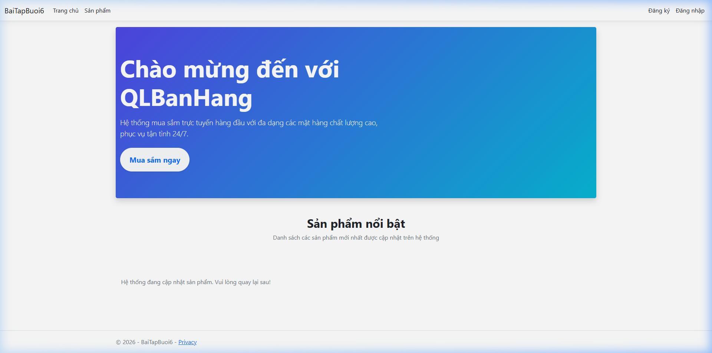
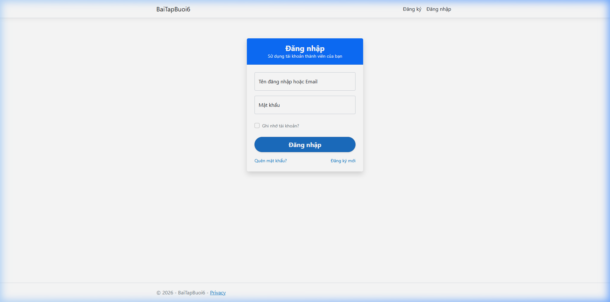
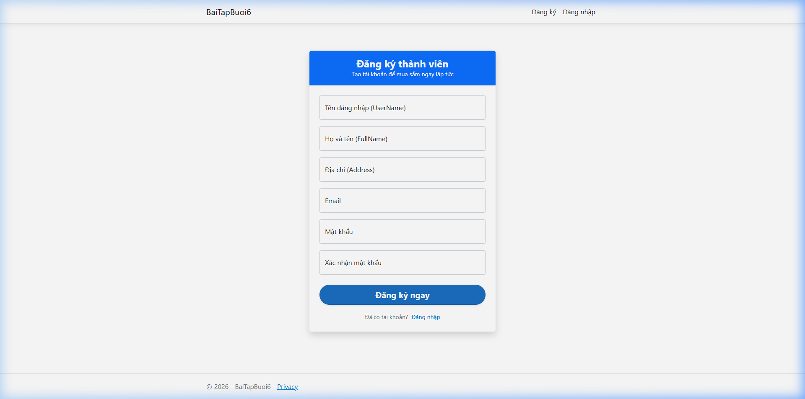
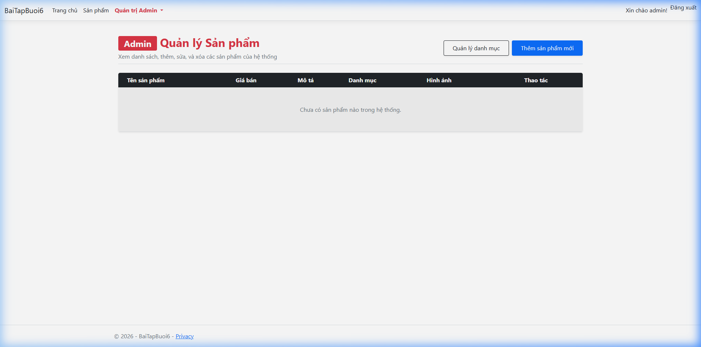
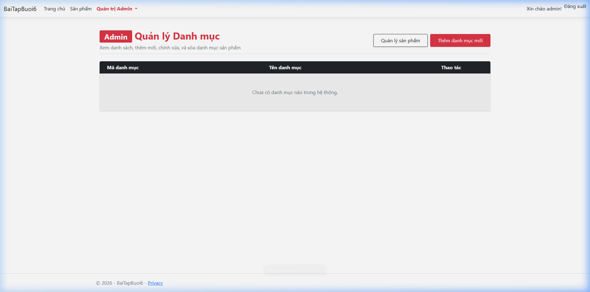
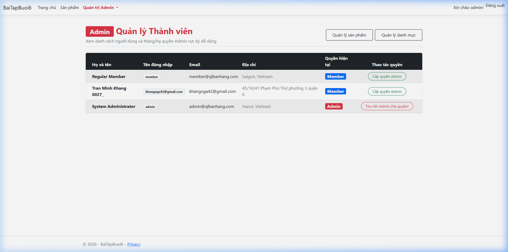

# 🛍️ Hệ thống Quản lý Bán hàng & eCommerce (BaiTapBuoi6)

Chào mừng bạn đến với **Hệ thống Quản lý Bán hàng & eCommerce nâng cao**. Đây là dự án web ASP.NET Core MVC hoàn chỉnh, tích hợp tính năng **Xác thực (Authentication)**, **Phân quyền (Authorization)**, phân chia vùng hành vi (**Areas**) và trang bị giao diện Bootstrap 5 siêu đẹp, hiện đại.

---

## 🚀 Các Tính Năng Nổi Bật

### 1. 🔐 Xác thực & Phân quyền Identity nâng cao
* **Tài khoản tùy biến (`ApplicationUser`):** Tích hợp thêm hai trường `Họ và tên (FullName)` và `Địa chỉ (Address)` vào bảng `AspNetUsers`.
* **Đăng nhập linh hoạt (Username/Email):** Người dùng có thể đăng nhập bằng cả **Tên đăng nhập (UserName)** hoặc **Địa chỉ Email** rất tiện lợi (không bị bó buộc chỉ dùng email như mặc định).
* **Đăng ký mặc định:** Tất cả tài khoản mới đăng ký qua trang Register sẽ tự động được gán vai trò `"Member"`.

### 2. 🛡️ Phân vùng Quản trị Admin (`Areas/Admin`) cô lập & an toàn
Chỉ các tài khoản có vai trò `"Admin"` mới truy cập được phân vùng quản trị này để quản lý hệ thống:
* **Quản lý Sản phẩm (Products CRUD):** Xem danh sách, thêm mới sản phẩm kèm tải lên hình ảnh, chỉnh sửa và xóa sản phẩm.
* **Quản lý Danh mục (Categories CRUD):** Xem danh sách danh mục và tạo mới/chỉnh sửa/xóa.
* **Quản lý Thành viên (User Management - Tính năng nâng cao):** Admin xem được danh sách toàn bộ người dùng và có thể **Thăng quyền làm Admin** hoặc **Thu hồi quyền Admin (Hạ xuống Member thường)** của bất kỳ người dùng nào chỉ bằng một nút bấm trực quan!

### 3. 🛒 Giao diện mua sắm công cộng cho Member & Khách vãng lai
* **Bộ lọc danh mục (Sidebar):** Khách hàng dễ dàng lọc danh sách sản phẩm theo danh mục ở sidebar bên trái.
* **Xem chi tiết sản phẩm:** Giao diện chi tiết sản phẩm công cộng loại bỏ hoàn toàn các chức năng quản trị để đảm bảo bảo mật.

### 4. ⚠️ Xóa liên hoàn (Cascade Delete) an toàn
* Khi Admin thực hiện xóa danh mục, hệ thống đã cấu hình tự động xóa toàn bộ các sản phẩm thuộc danh mục đó.
* View xóa danh mục hiển thị hộp thoại cảnh báo nổi bật màu đỏ rất an toàn và minh bạch.

---

## 🔑 Tài khoản Mẫu mặc định (Đã được Seed sẵn)

| Vai trò | Tên đăng nhập | Email | Mật khẩu |
| :--- | :--- | :--- | :--- |
| **Admin** | `admin` | `admin@qlbanhang.com` | `admin` |
| **Member** | `member` | `member@qlbanhang.com` | `member` |

---

## 📸 Hình ảnh Minh họa các Tính năng

### 🏠 1. Trang chủ Công cộng (Public Catalog)
Giao diện mua sắm của khách hàng với danh mục lọc bên trái và danh sách sản phẩm dạng lưới bắt mắt:


### 🔑 2. Trang Đăng nhập thông minh (UserName/Email)
Hỗ trợ đăng nhập siêu nhanh bằng username `admin` hoặc `member` cực kỳ mượt mà:


### 📝 3. Trang Đăng ký với các trường mở rộng
Cho phép người dùng mới nhập thêm Họ và tên cũng như Địa chỉ trực tiếp:


### 📦 4. Quản lý Sản phẩm (Khu vực Admin)
Giao diện quản lý toàn diện các mặt hàng dành riêng cho Admin:


### 🏷️ 5. Quản lý Danh mục (Khu vực Admin)
Giao diện danh mục kèm chức năng Xóa liên hoàn (Cascade Delete) cảnh báo trực quan:


### 👥 6. Quản lý Thành viên & Phân quyền Admin (Nâng cao)
Nơi Admin thăng/hạ quyền và kiểm soát vai trò của mọi User trong hệ thống chỉ bằng 1 Click:


---

## 🛠️ Hướng dẫn Cài đặt & Chạy ứng dụng

1. **Chuẩn bị cơ sở dữ liệu SQL Server:**
   Đảm bảo bạn đang cài đặt **SQL Server Express** hoạt động tại `localhost\SQLEXPRESS`.
   
2. **Khởi tạo và Cập nhật Database:**
   Mở Terminal tại thư mục gốc dự án và chạy lệnh sau để tự động tạo database `QLBanHang`:
   ```powershell
   dotnet ef database update
   ```
   
3. **Chạy ứng dụng:**
   Chạy lệnh sau để khởi động Web Server:
   ```powershell
   dotnet run --launch-profile https
   ```
   Sau đó, mở trình duyệt và truy cập `https://localhost:7003` hoặc `http://localhost:5054` để trải nghiệm hệ thống!
